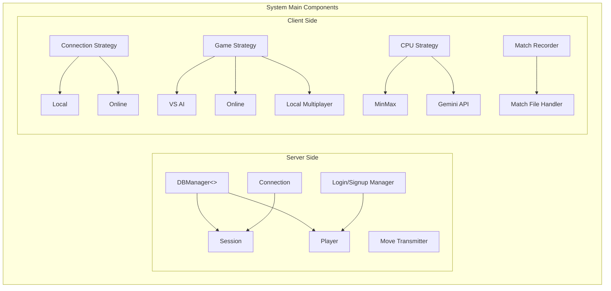
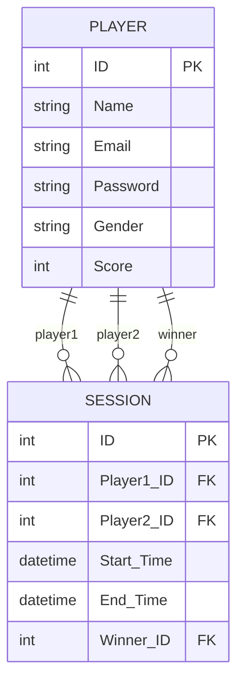
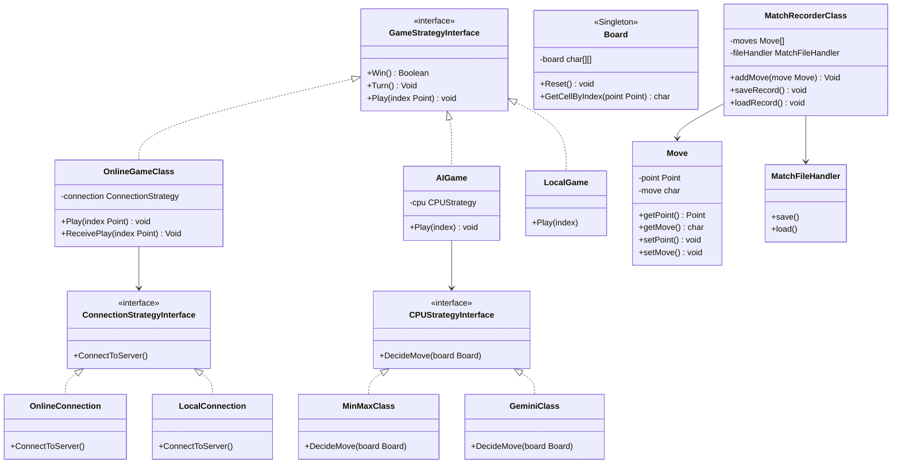
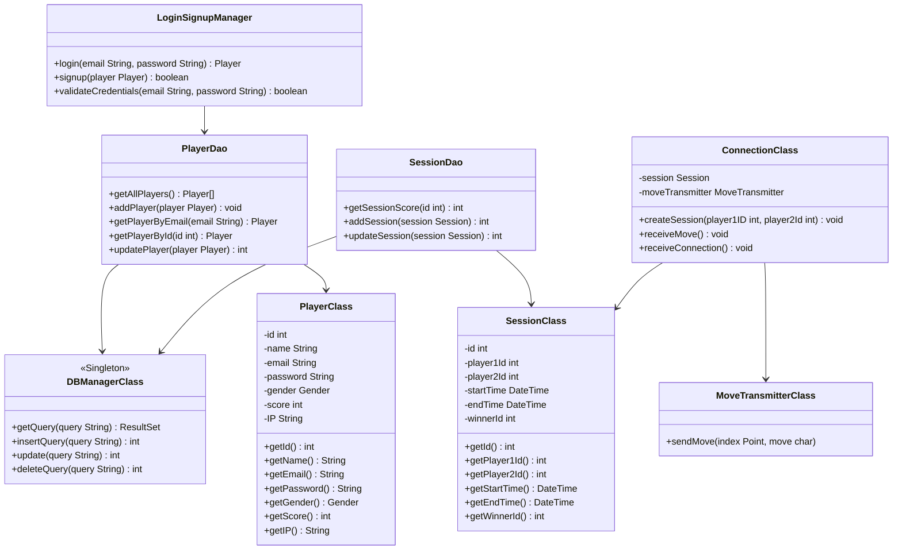

# System Main Components

```mermaid
graph TB
    subgraph SystemMain["System Main Components"]
        subgraph ServerSide["Server Side"]
            DBManager["DBManager<<Singleton>>"]
            Connection["Connection"]
            MoveTransmitter["Move Transmitter"]
            LoginManager["Login/Signup Manager"]
            Session["Session"]
            Player["Player"]
            
            DBManager --> Session
            DBManager --> Player
            Connection --> Session
            MoveTransmitter
            LoginManager --> Player
        end
        
        subgraph ClientSide["Client Side"]
            ConnectionStrategy["Connection Strategy"]
            Local["Local"]
            Online["Online"]
            
            GameStrategy["Game Strategy"]
            VSAI["VS AI"]
            OnlineGame["Online"]
            LocalMultiplayer["Local Multiplayer"]
            
            CPUStrategy["CPU Strategy"]
            MinMax["MinMax"]
            GeminiAPI["Gemini API"]
            
            MatchRecorder["Match Recorder"]
            MatchFileHandler["Match File Handler"]
            
            ConnectionStrategy --> Local
            ConnectionStrategy --> Online
            
            GameStrategy --> VSAI
            GameStrategy --> OnlineGame
            GameStrategy --> LocalMultiplayer
            
            CPUStrategy --> MinMax
            CPUStrategy --> GeminiAPI
            
            MatchRecorder --> MatchFileHandler
        end
    end
```
# Database Schema

```mermaid
erDiagram
    PLAYER {
        int ID PK
        string Name
        string Email
        string Password
        string Gender
        int Score
    }
    
    SESSION {
        int ID PK
        int Player1_ID FK
        int Player2_ID FK
        datetime Start_Time
        datetime End_Time
        int Winner_ID FK
    }
    
    PLAYER ||--o{ SESSION : "player1"
    PLAYER ||--o{ SESSION : "player2"
    PLAYER ||--o{ SESSION : "winner"
```
# UML Class Diagrams

## Client Side

```mermaid
classDiagram
    class ConnectionStrategyInterface {
        <<interface>>
        +ConnectToServer()
    }
    
    class OnlineConnection {
        +ConnectToServer()
    }
    
    class LocalConnection {
        +ConnectToServer()
    }
    
    ConnectionStrategyInterface <|.. OnlineConnection
    ConnectionStrategyInterface <|.. LocalConnection
    
    class GameStrategyInterface {
        <<interface>>
        +Win() Boolean
        +Turn() Void
        +Play(index Point) void
    }
    
    class OnlineGameClass {
        -connection ConnectionStrategy
        +Play(index Point) void
        +ReceivePlay(index Point) Void
    }
    
    class AIGame {
        -cpu CPUStrategy
        +Play(index) void
    }
    
    class LocalGame {
        +Play(index)
    }
    
    GameStrategyInterface <|.. OnlineGameClass
    GameStrategyInterface <|.. AIGame
    GameStrategyInterface <|.. LocalGame
    
    class CPUStrategyInterface {
        <<interface>>
        +DecideMove(board Board)
    }
    
    class MinMaxClass {
        +DecideMove(board Board)
    }
    
    class GeminiClass {
        +DecideMove(board Board)
    }
    
    CPUStrategyInterface <|.. MinMaxClass
    CPUStrategyInterface <|.. GeminiClass
    
    AIGame --> CPUStrategyInterface
    OnlineGameClass --> ConnectionStrategyInterface
    
    class Board {
        <<Singleton>>
        -board char[][]
        +Reset() void
        +GetCellByIndex(point Point) char
    }
    
    class MatchRecorderClass {
        -moves Move[]
        -fileHandler MatchFileHandler
        +addMove(move Move) Void
        +saveRecord() void
        +loadRecord() void
    }
    
    class Move {
        -point Point
        -move char
        +getPoint() Point
        +getMove() char
        +setPoint() void
        +setMove() void
    }
    
    class MatchFileHandler {
        +save()
        +load()
    }
    
    MatchRecorderClass --> Move
    MatchRecorderClass --> MatchFileHandler
```

## Server Side

```mermaid
classDiagram
    class DBManagerClass {
        <<Singleton>>
        +getQuery(query String) ResultSet
        +insertQuery(query String) int
        +update(query String) int
        +deleteQuery(query String) int
    }
    
    class PlayerDao {
        +getAllPlayers() Player[]
        +addPlayer(player Player) void
        +getPlayerByEmail(email String) Player
        +getPlayerById(id int) Player
        +updatePlayer(player Player) int
    }
    
    class SessionDao {
        +getSessionScore(id int) int
        +addSession(session Session) int
        +updateSession(session Session) int
    }
    
    PlayerDao --> DBManagerClass
    SessionDao --> DBManagerClass
    
    class PlayerClass {
        -id int
        -name String
        -email String
        -password String
        -gender Gender
        -score int
        -IP String
        +getId() int
        +getName() String
        +getEmail() String
        +getPassword() String
        +getGender() Gender
        +getScore() int
        +getIP() String
    }
    
    class SessionClass {
        -id int
        -player1Id int
        -player2Id int
        -startTime DateTime
        -endTime DateTime
        -winnerId int
        +getId() int
        +getPlayer1Id() int
        +getPlayer2Id() int
        +getStartTime() DateTime
        +getEndTime() DateTime
        +getWinnerId() int
    }
    
    PlayerDao --> PlayerClass
    SessionDao --> SessionClass
    
    class MoveTransmitterClass {
        +sendMove(index Point, move char)
    }
    
    class ConnectionClass {
        -session Session
        -moveTransmitter MoveTransmitter
        +createSession(player1ID int, player2Id int) void
        +receiveMove() void
        +receiveConnection() void
    }
    
    ConnectionClass --> SessionClass
    ConnectionClass --> MoveTransmitterClass
    
    class LoginSignupManager {
        +login(email String, password String) Player
        +signup(player Player) boolean
        +validateCredentials(email String, password String) boolean
    }
    
    LoginSignupManager --> PlayerDao
```
